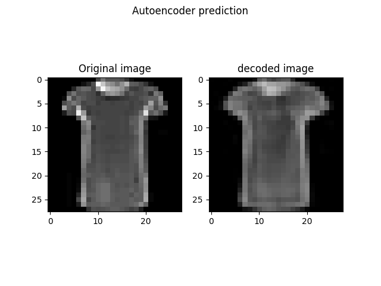
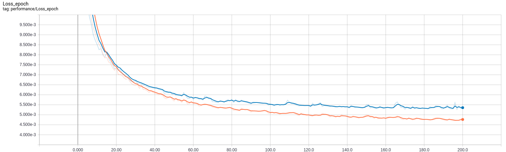

# Tensorflow Implementation of Convolutional Autoencoder
### Project details
**Autoencoder** is used as powerful tool to extract important features from the input data and then use the encoded (latent) represntation as a new input to a classification machine learning model. The nice thing about autoencoders is that we don't need labels to train them and they are belong to **unsupervised learning**. In simple words, they do the *dimensionality reduction* while preserving the vital features that are transformed in *latent space*. For image classification/detection task, a particular type of autoencoder called **convolutional autoencoder** (CAE) is used.

This project demonstrates how CAE can be implemented in tensorflow framework. It also contains a sample pretrained model which is trained on **Fashion-MNIST Dataset**.

### Getting started
1. Make sure `python 3.x` is installed
2. To install other dependencies:
```
pip install -r requirements.txt
``` 
3. To test a pretrained model (like examples in out folder) with random image from validation set, run 
```
python autoencoder.py test -m ./out/Training__20190407_154622/autoencoder_latest.meta
```
4. To start training from initial weights, run 
```
python autoencoder.py train
```
5. To continue training from pretrained model, run 
```
python autoencoder.py train -m ./out/Training__20190407_154622/autoencoder_latest.meta
```
6. To get these details in terminal, simply execute
```
python autoencoder.py -h
```

### Results
1. When testing the pretrained model, you should see something like this

2. The training and validation loss convergence of the trained model is shown below:


### Instructions
1. **data** folder contains the fashion-MNIST data which can be replaced with custom dataset as well.
2. **out** folder gets automatically created when model is getting trained. It contains the latest and the best model checkpoints. It also stores the log necessary for tensorboard visualization.
3. **autoencoder.py** contians the main code for training and testing the model.
4. **autoencoder_model_db.py** file contains sample model architectures of CAE. Please modify or add new definitions here. Please esure that `autoencoder.py` file is modified accordingly to call the new function.
5. **fashion_mnist_utils** contains the functions related particular to *fashion-MNIST dataset* for pre-processing and loading.
6. To see the training progress/summary and also compare between different models, use **tensorboard** for visualization by running
```
tensorboard --logdir='./out/'
```

### Future work
1. Compare the results of image classifications with and without autoencoders and show the potential application of CAE.
