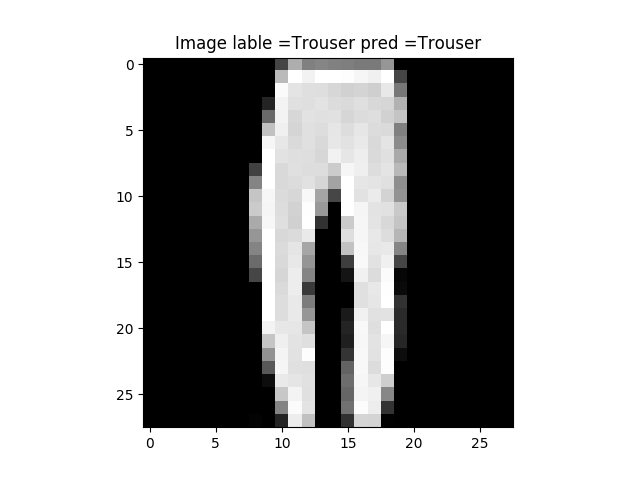
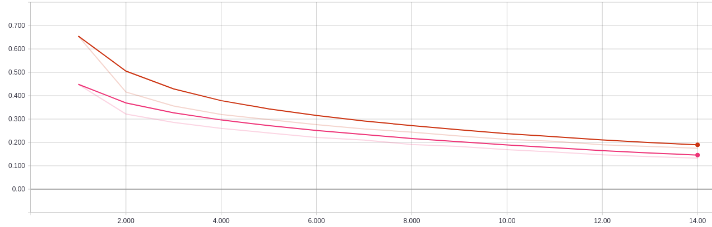

# Tensorflow Implementation of Convolutional Autoencoder
### Project details
**Autoencoder** is used as powerful tool to extract important features from the input data and then use the encoded (latent) represntation as a new input for classification model. The nice thing about autoencoder is that we don't need labels to train it and it belong to **unsupervised learning** technically. In simple words, it does the *dimensionality reduction* while preserving the vital features that are transformed into a *latent space*. For an image classification/detection task, a particular type of autoencoder called **convolutional autoencoder** (CAE) is used.

This project demonstrates how CAE can be implemented in tensorflow framework as a feature extractor for an image classification task. It also contains a sample pretrained model which is trained on **Fashion-MNIST Dataset**.

### Getting started
1. Make sure `python 3.x` is installed
2. To install other dependencies:
```
pip install -r requirements.txt
``` 
3. To test a pretrained autoencoder model (like examples in out/autoencoder folder) by feeding a random image from validation set, run 
```
python autoencoder.py test -m ./out/autoencoder/sample/autoencoder_latest.meta
```
4. To train a new autoencoder model, run 
```
python autoencoder.py train
```
5. To continue training a pretrained autoencoder model, run 
```
python autoencoder.py train -m ./out/autoencoder/sample/autoencoder_latest.meta
```
6. To get these details in terminal, simply execute
```
python autoencoder.py -h
```
7. To test a pretrained classifer model by (like examples in out/classifier folder) by feeding a random image from validation set, run 
```
python classifier.py test -m ./out/classifier/sample_pretrained_trainable/classifier_best.meta
```
8. To train a new classifier model with pretrained autoencoder weights, run 
```
python classifier.py train start -a ./out/autoencoder/sample/autoencoder_best.meta
```
To make autoencoder layers trainable,
```
python classifier.py train start -a ./out/autoencoder/sample/autoencoder_best.meta -t
```
with random weights replacing pretrianed autoencoder (only using autoencoder model grpah)
```
python classifier.py train start -a ./out/autoencoder/sample/autoencoder_best.meta -r
```
9. To continue training a pretrained classifier model, run 
```
python classifier.py train continue -m ./out/classifier/sample_pretrained_trainable/classifier_latest.meta
```
10.To get these details in terminal, simply execute
```
python classifier.py -h
``` 

### Results
1. When the pretrained autoencoder model is tested, you should see the output something like this

2. The training and validation loss convergence of the trained autoencoder model is shown below:

3. When the pretrained classifier model is tested, you should see the output something like this

4. The Training convergence of classifier models with pretrained autoencoder weights and random weights:

 
### Instructions
1. **data** folder contains the *fashion-MNIST dataset* which can be replaced with custom dataset as well.
2. **out** folder gets automatically created when the model is getting trained. It contains the latest and the best model checkpoints. It also stores the log necessary for tensorboard visualization.
3. **autoencoder.py** contians the main code for training and testing the autoencoder model.
4. **autoencoder_model_db.py** file contains some example model architectures of CAE. Please modify or add new definitions here. Please esure that `autoencoder.py` file is modified accordingly to call the new function. Please name the layers with proper prefix as shown in example model as it is required to import the encoder during classifier model creation.
5. **fashion_mnist_utils.py** contains the functions related to pre-processing and loading of *fashion-MNIST dataset*.
6. **classifier.py** contians the main code for training and testing the classifier model.
7. **classifier_model_db.py** file contains some example model architectures of classifier by importing the encoder graph from autoencoder mdoel. Please modify or add new definitions here. Please esure that `classifier.py` file is modified accordingly to call the new function.
8. To see the training progress/summary and also compare between different models, use **tensorboard** for visualization by running
```
tensorboard --logdir='./out/'
```

